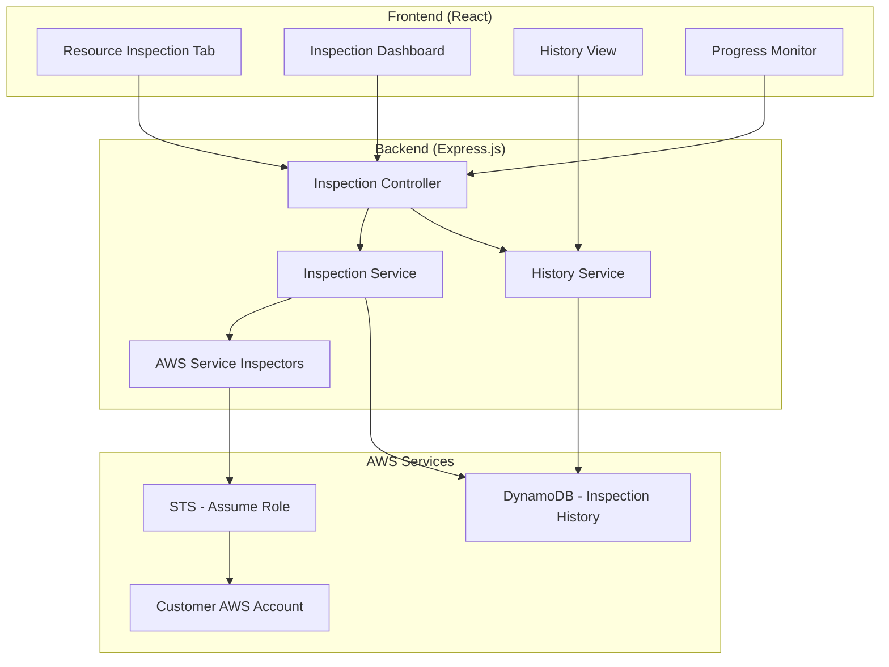

# Design Document

## Overview

AWS 리소스 검사 시스템은 기존 AWS 사용자 관리 시스템에 새로운 탭으로 추가되는 기능입니다. 이 시스템은 승인된 고객이 특정 AWS 서비스에 대한 보안 및 모범 사례 검사를 요청할 수 있게 하며, assume role을 통해 고객의 AWS 계정에 접근하여 검사를 수행합니다. 모든 검사 결과와 이력은 DynamoDB에 저장되어 관리됩니다.

## Architecture

### High-Level Architecture



### System Flow

1. **검사 요청**: 고객이 프론트엔드에서 특정 AWS 서비스 검사를 요청
2. **인증 및 권한 확인**: 시스템이 고객의 승인 상태 확인
3. **Assume Role**: STS를 통해 고객 계정의 검사 역할로 전환
4. **리소스 검사**: 해당 서비스의 검사 모듈이 리소스를 스캔하고 분석
5. **결과 저장**: 검사 결과를 DynamoDB에 저장
6. **결과 반환**: 프론트엔드에 검사 결과 전송

## Components and Interfaces

### Frontend Components

#### 1. ResourceInspectionTab
- **목적**: 메인 네비게이션에 새로운 탭 추가
- **위치**: `frontend/src/components/ResourceInspectionTab.js`
- **기능**: 
  - 사용 가능한 AWS 서비스 검사 목록 표시
  - 검사 시작 버튼
  - 검사 진행 상황 모니터링

#### 2. InspectionDashboard
- **목적**: 검사 결과 대시보드
- **위치**: `frontend/src/components/InspectionDashboard.js`
- **기능**:
  - 검사 결과 시각화
  - 위험도별 분류 (High, Medium, Low)
  - 권장사항 표시

#### 3. InspectionHistory
- **목적**: 검사 이력 관리
- **위치**: `frontend/src/components/InspectionHistory.js`
- **기능**:
  - 과거 검사 결과 목록
  - 검사 결과 비교
  - 상세 결과 조회

### Backend Components

#### 1. Inspection Controller
- **위치**: `backend/controllers/inspectionController.js`
- **엔드포인트**:
  ```javascript
  POST /api/inspections/start
  GET /api/inspections/:id
  GET /api/inspections/history
  GET /api/inspections/:id/status
  ```

#### 2. Inspection Service
- **위치**: `backend/services/inspectionService.js`
- **기능**:
  - 검사 오케스트레이션
  - 검사 상태 관리
  - 결과 집계 및 분석

#### 3. AWS Service Inspectors
- **위치**: `backend/services/inspectors/`
- **구조**:
  ```
  inspectors/
  ├── baseInspector.js      # 공통 인터페이스
  ├── ec2Inspector.js       # EC2 검사 로직
  ├── rdsInspector.js       # RDS 검사 로직
  └── s3Inspector.js        # S3 검사 로직
  ```

#### 4. History Service
- **위치**: `backend/services/historyService.js`
- **기능**:
  - 검사 이력 저장/조회
  - 결과 비교 분석
  - 통계 생성

## Data Models

### DynamoDB Tables

#### 1. InspectionHistory Table
```javascript
{
  TableName: "InspectionHistory",
  KeySchema: [
    { AttributeName: "customerId", KeyType: "HASH" },
    { AttributeName: "inspectionId", KeyType: "RANGE" }
  ],
  AttributeDefinitions: [
    { AttributeName: "customerId", AttributeType: "S" },
    { AttributeName: "inspectionId", AttributeType: "S" },
    { AttributeName: "serviceType", AttributeType: "S" },
    { AttributeName: "timestamp", AttributeType: "N" }
  ],
  GlobalSecondaryIndexes: [
    {
      IndexName: "ServiceTypeIndex",
      KeySchema: [
        { AttributeName: "customerId", KeyType: "HASH" },
        { AttributeName: "serviceType", KeyType: "RANGE" }
      ]
    },
    {
      IndexName: "TimestampIndex",
      KeySchema: [
        { AttributeName: "customerId", KeyType: "HASH" },
        { AttributeName: "timestamp", KeyType: "RANGE" }
      ]
    }
  ]
}
```

#### 2. Inspection Record Structure
```javascript
{
  customerId: "customer-123",
  inspectionId: "inspection-uuid",
  serviceType: "EC2",
  status: "COMPLETED", // PENDING, IN_PROGRESS, COMPLETED, FAILED
  startTime: 1640995200000,
  endTime: 1640995800000,
  duration: 600000,
  results: {
    summary: {
      totalResources: 25,
      highRiskIssues: 3,
      mediumRiskIssues: 7,
      lowRiskIssues: 2,
      score: 75
    },
    findings: [
      {
        resourceId: "sg-123456",
        resourceType: "SecurityGroup",
        riskLevel: "HIGH",
        issue: "Security group allows unrestricted access (0.0.0.0/0) on port 22",
        recommendation: "Restrict SSH access to specific IP ranges",
        details: {
          groupId: "sg-123456",
          rules: [...]
        }
      }
    ]
  },
  assumeRoleArn: "arn:aws:iam::123456789012:role/InspectionRole",
  metadata: {
    version: "1.0",
    inspectorVersion: "ec2-inspector-v1.2"
  }
}
```

### API Response Models

#### Inspection Status Response
```javascript
{
  success: true,
  data: {
    inspectionId: "inspection-uuid",
    status: "IN_PROGRESS",
    progress: {
      currentStep: "Analyzing Security Groups",
      completedSteps: 3,
      totalSteps: 8,
      percentage: 37.5
    },
    estimatedTimeRemaining: 180000
  }
}
```

#### Inspection Results Response
```javascript
{
  success: true,
  data: {
    inspectionId: "inspection-uuid",
    serviceType: "EC2",
    summary: {
      totalResources: 25,
      highRiskIssues: 3,
      mediumRiskIssues: 7,
      lowRiskIssues: 2,
      overallScore: 75
    },
    findings: [...],
    recommendations: [...],
    completedAt: "2024-01-01T12:00:00Z"
  }
}
```

## Error Handling

### Error Categories

1. **Authentication Errors**
   - Invalid assume role credentials
   - Insufficient permissions
   - Role assumption timeout

2. **AWS Service Errors**
   - Service unavailable
   - Rate limiting
   - Resource access denied

3. **System Errors**
   - Database connection failures
   - Internal processing errors
   - Timeout errors

### Error Response Format
```javascript
{
  success: false,
  error: {
    code: "ASSUME_ROLE_FAILED",
    message: "Failed to assume role in customer account",
    details: {
      roleArn: "arn:aws:iam::123456789012:role/InspectionRole",
      reason: "Access denied"
    },
    timestamp: "2024-01-01T12:00:00Z"
  }
}
```

## Testing Strategy

### Unit Tests
- **Backend Services**: 각 inspector 모듈의 개별 기능 테스트
- **Frontend Components**: React 컴포넌트의 렌더링 및 상호작용 테스트
- **Data Models**: DynamoDB 스키마 및 쿼리 테스트

### Integration Tests
- **API Endpoints**: 전체 검사 플로우 테스트
- **AWS Integration**: Mock AWS 서비스를 사용한 assume role 테스트
- **Database Integration**: DynamoDB 연동 테스트

### End-to-End Tests
- **Complete Inspection Flow**: 검사 요청부터 결과 표시까지 전체 플로우
- **Error Scenarios**: 다양한 오류 상황에 대한 처리 테스트
- **Performance Tests**: 대용량 리소스 검사 성능 테스트

### Test Data Strategy
- **Mock AWS Responses**: 실제 AWS 호출 없이 테스트 가능한 mock 데이터
- **Test Customer Accounts**: 안전한 테스트 환경을 위한 격리된 계정
- **Synthetic Data**: 다양한 시나리오를 위한 합성 데이터 생성

## Security Considerations

### Assume Role Security
- **최소 권한 원칙**: 검사에 필요한 최소한의 권한만 부여
- **시간 제한**: assume role 세션의 짧은 유효 기간 설정
- **감사 로깅**: 모든 assume role 활동 로깅

### Data Protection
- **결과 암호화**: 민감한 검사 결과의 저장 시 암호화
- **접근 제어**: 고객별 데이터 격리 및 접근 제어
- **데이터 보존**: 검사 결과의 자동 만료 및 삭제 정책

### API Security
- **인증**: JWT 토큰 기반 API 인증
- **권한 부여**: 고객별 리소스 접근 권한 확인
- **Rate Limiting**: API 호출 빈도 제한

## Performance Optimization

### Caching Strategy
- **검사 결과 캐싱**: 최근 검사 결과의 임시 캐싱
- **AWS API 응답 캐싱**: 변경이 적은 리소스 정보 캐싱
- **메타데이터 캐싱**: 서비스 정보 및 설정 캐싱

### Parallel Processing
- **동시 검사**: 독립적인 검사 항목의 병렬 실행
- **배치 처리**: 대량 리소스의 배치 단위 처리
- **비동기 처리**: 장시간 검사의 비동기 실행

### Database Optimization
- **인덱스 최적화**: 자주 사용되는 쿼리 패턴에 맞는 인덱스
- **파티셔닝**: 고객별 데이터 파티셔닝
- **압축**: 대용량 검사 결과의 압축 저장