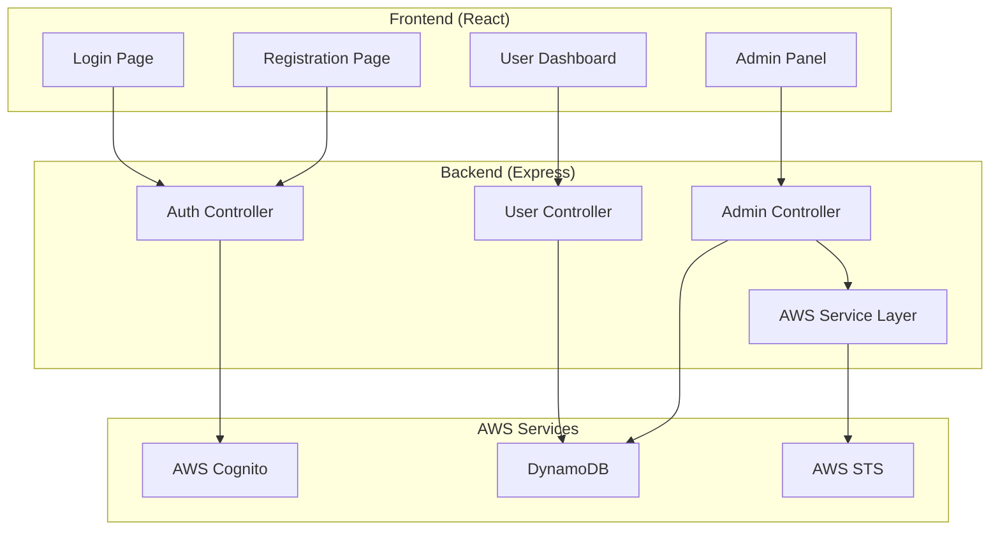

# Design Document

## Overview

AWS 역할 기반 사용자 관리 시스템은 React 프론트엔드와 Express 백엔드로 구성된 풀스택 웹 애플리케이션입니다. AWS Cognito를 통한 사용자 인증, DynamoDB를 통한 사용자 데이터 저장, 그리고 AWS STS를 통한 Role ARN 검증을 핵심 기능으로 합니다.

## Architecture

### High-Level Architecture



### Technology Stack

**Frontend:**
- React 18
- React Router for navigation
- Axios for HTTP requests
- AWS Amplify UI components (optional, for Cognito integration)

**Backend:**
- Node.js v22.19.0
- Express.js
- AWS SDK v3
- CORS middleware
- JWT for session management

**AWS Services:**
- AWS Cognito User Pool (사용자 인증)
- DynamoDB (사용자 메타데이터 저장)
- AWS STS (Role ARN 검증)

## Components and Interfaces

### Frontend Components

#### 1. Authentication Components
- **LoginForm**: Cognito 로그인 처리
- **RegisterForm**: 회원가입 폼 (ID, 비밀번호, AWS Role ARN, 회사명)
- **AuthGuard**: 인증 상태 확인 컴포넌트

#### 2. User Components
- **UserDashboard**: 사용자 상태 표시 (승인 대기, 활성, 거부됨)
- **UserProfile**: 사용자 정보 표시

#### 3. Admin Components
- **AdminPanel**: 관리자 전용 페이지
- **UserList**: 전체 사용자 목록
- **UserManagement**: 사용자 승인/거부 관리
- **ARNValidator**: AWS Role ARN 검증 버튼 및 결과 표시

### Backend API Endpoints

#### Authentication Endpoints
```
POST /api/auth/register
- Body: { username, password, roleArn, companyName }
- Response: { success, message, userId }

POST /api/auth/login
- Body: { username, password }
- Response: { success, token, userStatus }

GET /api/auth/verify
- Headers: Authorization: Bearer <token>
- Response: { valid, userInfo }
```

#### User Management Endpoints
```
GET /api/users/profile
- Headers: Authorization: Bearer <token>
- Response: { userInfo, status }

GET /api/admin/users
- Headers: Authorization: Bearer <admin-token>
- Response: { users: [{ id, username, companyName, status, roleArn, arnValid }] }

PUT /api/admin/users/:userId/status
- Headers: Authorization: Bearer <admin-token>
- Body: { status: 'approved' | 'rejected' }
- Response: { success, message }

POST /api/admin/users/:userId/validate-arn
- Headers: Authorization: Bearer <admin-token>
- Response: { valid, error?, lastChecked }
```

## Data Models

### DynamoDB Tables

#### Users Table
```json
{
  "TableName": "Users",
  "KeySchema": [
    {
      "AttributeName": "userId",
      "KeyType": "HASH"
    }
  ],
  "AttributeDefinitions": [
    {
      "AttributeName": "userId",
      "AttributeType": "S"
    },
    {
      "AttributeName": "username",
      "AttributeType": "S"
    }
  ],
  "GlobalSecondaryIndexes": [
    {
      "IndexName": "username-index",
      "KeySchema": [
        {
          "AttributeName": "username",
          "KeyType": "HASH"
        }
      ]
    }
  ]
}
```

#### User Record Structure
```json
{
  "userId": "string (UUID)",
  "username": "string",
  "companyName": "string",
  "roleArn": "string",
  "status": "pending | approved | rejected",
  "arnValidation": {
    "isValid": "boolean",
    "lastChecked": "timestamp",
    "error": "string?"
  },
  "createdAt": "timestamp",
  "updatedAt": "timestamp"
}
```

### AWS Cognito User Pool Configuration
```json
{
  "UserPoolName": "aws-user-management-pool",
  "Policies": {
    "PasswordPolicy": {
      "MinimumLength": 8,
      "RequireUppercase": true,
      "RequireLowercase": true,
      "RequireNumbers": true,
      "RequireSymbols": false
    }
  },
  "UsernameAttributes": ["email"],
  "AutoVerifiedAttributes": ["email"],
  "Schema": [
    {
      "Name": "email",
      "Required": true
    }
  ]
}
```

## Error Handling

### Frontend Error Handling
- **Network Errors**: 연결 실패 시 사용자 친화적 메시지 표시
- **Authentication Errors**: 로그인 실패 시 명확한 오류 메시지
- **Validation Errors**: 폼 입력 오류 시 필드별 오류 표시
- **Authorization Errors**: 권한 없는 접근 시 로그인 페이지로 리디렉션

### Backend Error Handling
```javascript
// Error Response Format
{
  "success": false,
  "error": {
    "code": "ERROR_CODE",
    "message": "Human readable message",
    "details": "Additional error details"
  }
}

// Common Error Codes
- AUTH_FAILED: 인증 실패
- USER_EXISTS: 사용자 이미 존재
- USER_NOT_FOUND: 사용자 찾을 수 없음
- INVALID_ARN: 유효하지 않은 Role ARN
- PERMISSION_DENIED: 권한 없음
- VALIDATION_ERROR: 입력 데이터 검증 실패
```

### AWS Service Error Handling
- **Cognito Errors**: 사용자 생성/인증 실패 처리
- **DynamoDB Errors**: 데이터베이스 연결 및 쿼리 오류 처리
- **STS Errors**: Role ARN assume role 실패 처리

## Testing Strategy

### Frontend Testing
- **Unit Tests**: React 컴포넌트 개별 기능 테스트
- **Integration Tests**: API 호출 및 상태 관리 테스트
- **E2E Tests**: 사용자 플로우 전체 테스트 (회원가입 → 승인 → 로그인)

### Backend Testing
- **Unit Tests**: 개별 함수 및 미들웨어 테스트
- **Integration Tests**: API 엔드포인트 테스트
- **AWS Service Mocking**: AWS SDK 호출 모킹을 통한 테스트

### Test Scenarios
1. **회원가입 플로우**: 정상 가입, 중복 사용자, 유효하지 않은 입력
2. **로그인 플로우**: 정상 로그인, 잘못된 자격증명, 상태별 접근 권한
3. **관리자 기능**: 사용자 승인/거부, ARN 검증
4. **AWS 통합**: Cognito 인증, DynamoDB 읽기/쓰기, STS assume role

## Security Considerations

### Authentication & Authorization
- JWT 토큰 기반 세션 관리
- 관리자 권한 검증을 위한 별도 토큰 클레임
- CORS 설정으로 허용된 도메인만 접근 가능

### Data Protection
- 비밀번호는 Cognito에서 관리 (평문 저장 없음)
- AWS Role ARN 검증 시 임시 자격증명만 사용
- 민감한 정보는 HTTPS를 통해서만 전송

### AWS Security
- IAM 역할을 통한 최소 권한 원칙 적용
- DynamoDB 테이블 암호화 활성화
- Cognito User Pool에서 MFA 옵션 제공 (선택사항)

## Development Environment

### Local Development Setup
```
Frontend: localhost:3000 (React Dev Server)
Backend: localhost:5000 (Express Server)
AWS: Development AWS Account with local AWS credentials
```

### Environment Configuration
- AWS credentials configured via AWS CLI or environment variables
- Local development uses AWS services directly (no mocking)
- CORS configured to allow localhost:3000 → localhost:5000 communication